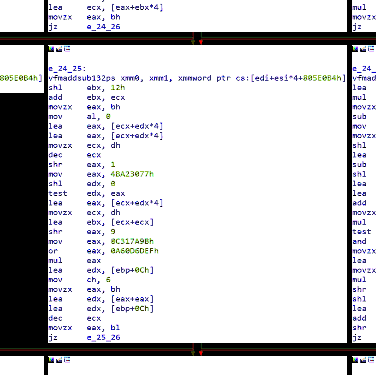

# REpsych
: Psychological Warfare in Reverse Engineering

github.com/xoreaxeaxeax/repsych // domas // @xoreaxeaxeax

### Overview

The REpsych toolset is a proof-of-concept illustrating the generation of images
through a program's [control flow
graph](https://en.wikipedia.org/wiki/Control_flow_graph) (CFG).

 A typical function's CFG    | A REpsych generated CFG
:---------------------------:|:------------------------------------:
     | 

There is no specific point to the project (other than to show that it can be
done), but possible (non-serious) applications are outlined in the [DEF CON
presentation](https://www.youtube.com/watch?v=HlUe0TUHOIc).

The program works reliably with all tested versions of the IDA Pro reverse
engineering tool, and semi-reliably with other CFG viewers (Hopper, BinNavi,
radare2, etc).

### Usage

The toolset translates source images into functioning programs, such that the
program's control flow graph generates the source image.  

To generate a new program from an image:

* Save the image in the gfx/ folder as a 24 BPP bitmap.
* Run "make image" in the root directory of the project, where "image" is the
  name of your image, without the extension.

Two functioning programs will be created: repsych_v1 and repsych_v2.  Each uses
a different strategy for ensuring the CFG renderer correctly places the CFG
nodes.

### Tips

The tool will create a basic block (CFG node) for each pixel of the source
image; as such, you should try to use small source images (not larger than
100x100), and you may need to increase the number of allowed nodes in your CFG
viewer.

When using an image of text as input to the tool, first convert the image to a
2 BPP black and white bitmap first, then to a 24 BPP bitmap; this will remove
non black and white colors, and give the best results in the control flow graph.

### Examples

### References

The technique is outlined in detail in the [DEF CON
presentation](https://www.youtube.com/watch?v=HlUe0TUHOIc).

Slides from the presentation are provided
[here](slides/domas_defcon_2015_repsych.pdf).

### Author

REpsych is a proof-of-concept from Christopher Domas
([@xoreaxeaxeax](https://twitter.com/xoreaxeaxeax)).
